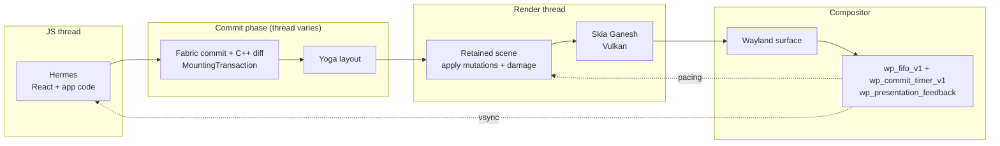

<div align="center">

# react-native-linux 🐧

### React Native for desktop Linux, GPU-first

Fabric rendered through Skia (Ganesh) and Vulkan straight into a Wayland surface, Hermes for
JavaScript, New Architecture only. No GTK, no Qt, no webview — we own the paint model end to end,
so React Native's styling semantics are ours to implement rather than to approximate through
somebody else's widget tree, and the frame loop is ours to pace.

[](LICENSE)
[](https://github.com/react-native-linux/react-native-linux/issues/1)
[](docs/adr/0001-gpu-first-out-of-tree-react-native-platform-for-linux.md)
[](#architecture)
[](AGENTS.md)

</div>

> [!NOTE]
> **Status: pre-alpha, M0 done, M1 in progress.** A Wayland/Vulkan/Skia Ganesh window runs a bridgeless
> `ReactInstance` built from source (RN 0.87.1 + Hermes) and draws Fabric's retained scene with
> `View`, `Text`, `Image` and `ScrollView`, damage tracking, pointer/keyboard input, a focus model
> and IME over `zwp_text_input_v3`; `TextInput` is in verification. ~220 GoogleTest cases at 100%
> line+branch coverage, ten visually reviewed goldens plus two window goldens, and seven CI jobs gate
> every change. Still missing from M1: gradients (#34), the e2e driver (#7); no npm publish, no app
> template or Metro wiring (M3), no accessibility (M5) yet. Track it all in the founding epic:
> [#1 — react-native-linux v0.1](https://github.com/react-native-linux/react-native-linux/issues/1).

## Try it

```bash
pnpm install
pnpm doctor
pnpm --filter @react-native-linux/core vendor
pnpm --filter @react-native-linux/core vendor:skia
pnpm --filter @react-native-linux/core vendor:fonts
cmake --preset dev && cmake --build build/dev
./build/dev/bin/rnl_window --fabric packages/core/test-bundles/view-props.js
pnpm test:golden
```

See [`docs/cpp-toolchain.md`](docs/cpp-toolchain.md) for what each step and binary proves.

---

## Why another attempt

Linux is the only major desktop without a maintained React Native platform. The pieces exist — Amazon ships
React Native core on a Linux-based OS at retail scale, `react-native-skia` got React Native drawing through
Skia on Linux as a proof of concept before going dormant, `react-native-harmony` proved out-of-tree New
Architecture platforms are buildable by outsiders. Nobody has assembled them for desktop Linux behind a
renderer that owns the paint model and its own frame loop — and the one project that tried the GPU canvas
stalled at proof-of-concept, which is a fact this project has to answer rather than inherit.

That ownership is the entire thesis, and it is what separates this from the neighbouring approaches:

| | **GPU-canvas Fabric**<br/>(this project) | **GTK4-widgets Fabric**<br/>[lucid-softworks](https://github.com/lucid-softworks/react-native-linux) | **Custom reconciler**<br/>[react-native-gtkx](https://github.com/itsmepetrov/react-native-gtkx) | **Webview**<br/>react-native-web |
|---|---|---|---|---|
| **Renderer ownership** | Ours, top to bottom | GTK owns the widget tree | GTK owns the widget tree | The browser engine owns everything |
| **Frame pacing control** | Direct: `wp_fifo_v1` + `wp_commit_timer_v1`, measured by `wp_presentation_feedback` | Mediated by `GdkFrameClock` (vsync-driven) | Mediated by `GdkFrameClock` (vsync-driven) | None — whatever the engine does |
| **Frame budget** | Ours, instrumented and gated in CI | GTK's, and GSK is a damage-tracked Vulkan renderer — not a ceiling | Same as GTK4 | Not a design goal |
| **RN paint semantics** | Implemented directly on the canvas | Approximated through GTK widgets + CSS | Approximated through GTK widgets | Web-engine approximation |
| **Native text / IME / a11y for free** | ❌ We must build all of it | ✅ Inherited from GTK | ✅ Inherited from GTK | ✅ Inherited from the engine |
| **RN ecosystem compatibility** | Fabric + TurboModules + codegen | Fabric + TurboModules + codegen | ❌ Not React Native — a separate reconciler | Web-shim subset only |

The honest trade is the "for free" row: choosing the GPU canvas means text shaping, input methods and
accessibility become *our* problems rather than free gifts — the same problems Flutter's Linux embedder
avoids by sitting on GTK. ADR-0001 accepts that risk explicitly, which is why IME is a prerequisite of M1
rather than a later nicety, and why AT-SPI has a milestone of its own.

**On lucid-softworks:** their GTK4 platform is real, alpha-quality, and further along than any predecessor.
It is complementary rather than competing — widgets-integration and GPU-canvas are genuinely different
products for genuinely different apps, and learnings flow in both directions.

## Architecture

Fabric computes the tree diff in C++ and hands us a `MountingTransaction` — a list of `ShadowViewMutation`s
over the five-operation set (Create, Delete, Insert, Remove, Update), already view-flattened. We apply those
mutations to a persistent scene and redraw only the damaged regions through Skia Ganesh on Vulkan, with
Graphite tracked as the successor backend once Skia recommends it for Linux. Yoga lays out during the commit
phase, on whichever thread commits; mounting is applied on the UI thread. Animations are native-driven from
day one on React Native's shared C++ animated node graph — a JavaScript stall must never drop a frame.



Pacing uses three distinct Wayland mechanisms and does not confuse them: `wl_surface.frame` callbacks
**throttle**, `wp_presentation_feedback` **measures** after the fact, and `wp_fifo_v1` + `wp_commit_timer_v1`
**schedule**. A timer fallback is mandatory rather than a fallback of last resort — a compositor is entitled
to stop sending frame callbacks to a surface it considers invisible, and Hyprland does exactly that for
windows on inactive workspaces. VRR and direct scanout are compositor policy, not something an application
earns by pacing well, so neither is a design assumption here.

Text goes through SkParagraph (HarfBuzz shaping, FreeType rasterization) with a paragraph cache and a GPU
glyph atlas. Wayland is the only first-class windowing target; X11 arrives only if it falls out of the
abstraction for free. Full reasoning, alternatives and accepted risks live in
[ADR-0001](docs/adr/0001-gpu-first-out-of-tree-react-native-platform-for-linux.md).

### Planned developer experience

Not implemented — this is the target shape of the API, recorded so the milestones have something to aim at.

```js
// react-native.config.js — PLANNED, does not work yet
module.exports = {
  platforms: {
    linux: { npmPackageName: '@react-native-linux/core' },
  },
};
```

```bash
# PLANNED, does not work yet
npx react-native run-linux
```

Packages will publish under the `@react-native-linux/*` npm scope. The unscoped `react-native-linux` npm
name holds a single 0.0.1 placeholder published in 2018 by an unrelated author and will never be used by
this project. On the repository name: [lucid-softworks/react-native-linux](https://github.com/lucid-softworks/react-native-linux)
predates this org by about three months on the GTK4 route — the name collision is ours to manage, and the
full naming and trademark disclosure lives in
[ADR-0001](docs/adr/0001-gpu-first-out-of-tree-react-native-platform-for-linux.md).

## Roadmap

Each milestone is demonstrable on its own — a thing you can run and watch, not a refactor.

| Milestone | Goal |
|---|---|
| [**M0**](https://github.com/react-native-linux/react-native-linux/milestone/1) ✅ | Wayland window + Skia Ganesh Vulkan surface + Hermes running a bundle; a `View` renders |
| [**M1**](https://github.com/react-native-linux/react-native-linux/milestone/2) 🚧 | The six core components, Yoga layout, pointer + keyboard events, `zwp_text_input_v3` IME so `TextInput` is genuinely usable |
| [**M2**](https://github.com/react-native-linux/react-native-linux/milestone/3) | Native-driven animations, damage tracking, `wp_fifo_v1` + `wp_commit_timer_v1` pacing measured with `wp_presentation_feedback` on Hyprland; the Hermes performance baseline |
| [**M3**](https://github.com/react-native-linux/react-native-linux/milestone/4) | Parallel codegen driver + TurboModule autolinking; CLI/Metro registration (`--platform linux`) |
| [**M4**](https://github.com/react-native-linux/react-native-linux/milestone/5) | Ecosystem porting programme — ~30 native dependencies, an explicit port-or-decline decision on Reanimated/worklets, then [Suuudokuuu](https://www.suuudokuuu.com) and AUR / omarchy-pkgs packaging |
| [**M5**](https://github.com/react-native-linux/react-native-linux/milestone/6) | AT-SPI accessibility over D-Bus; multi-window; hardening |

"Working" is defined narrowly and deliberately: `View`, `Text`, `Image`, `ScrollView`, `TextInput` and
`Pressable`, proven by running a real application.

## Quality bar

Four test layers gate every renderer feature from day one: unit tests (GoogleTest for C++, Vitest for
TypeScript) at **100% line and branch coverage**, golden-image tests rendered headlessly on lavapipe against
checked-in references, end-to-end runs driving a real bundle under a headless compositor with virtual Wayland
input, and performance gates that fail CI when the frame budget regresses. ASan/UBSan and TSan run the full
C++ suite on every pull request, and a feature that cannot be observed through the test harness is not
finished — see [AGENTS.md](AGENTS.md#testing-gospel-non-negotiable-day-one).

## Standing on shoulders

None of this is a from-scratch idea. It is an assembly of other people's proven work:

- **[Amazon Vega](https://developer.amazon.com/apps-and-games/vega)** — ships ReactCommon, Yoga, Hermes and Fabric as the app platform of a Linux-based OS on production retail devices. The rendering layer is undisclosed, but it settles the question of whether RN core belongs on Linux.
- **[react-native-skia](https://github.com/react-native-skia/react-native-skia)** — funded by **NAGRA**, with **Kudo Chien** among the contributors (*not* a Microsoft project, despite frequent misattribution, and not [Shopify's `react-native-skia`](https://github.com/Shopify/react-native-skia), which is a Skia drawing library for RN apps). It is the closest existing proof of this exact pipeline and it is also a cautionary one: its own README called it a proof of concept that "requires lots of work", it pinned RN 0.71 and Chrome m108, it never cut a release, and it has been dormant since 2023.
- **[react-native-windows](https://github.com/microsoft/react-native-windows)** and **[react-native-macos](https://github.com/microsoft/react-native-macos)** — the structural models for out-of-tree platform layout, C++ Fabric composition rendering, platform overrides, codegen wiring and CI shape.
- **[react-native-harmony](https://github.com/react-native-oh-library)** — the playbook for a complete out-of-tree New Architecture platform maintained outside Meta.
- **Meta's ReactCxxPlatform** — the portable C++ `ReactHost` in React Native core. It is the single change that makes a new platform tractable for a small team instead of a vendor-sized one.
- **[AccessKit](https://github.com/AccessKit/accesskit)** — the realistic path to AT-SPI accessibility for a GPU canvas that has no native widget tree to expose.
- **[lucid-softworks/react-native-linux](https://github.com/lucid-softworks/react-native-linux)** — fellow travellers on the GTK4 route, and the current state of the art for React Native on Linux.

## Research

- [**ADR-0001** — GPU-first out-of-tree React Native platform for Linux](docs/adr/0001-gpu-first-out-of-tree-react-native-platform-for-linux.md) — the founding decision: renderer choice, alternatives rejected, accepted risks, milestones.
- [**JS engine selection**](docs/research/js-engine-selection.md) — why Hermes, sourced from upstream repos: Hermes is CI-tested as a full runtime on Linux but ships no prebuilt runtime (build from source), its JIT is arm64-only, and RN 0.87's bridgeless core is engine-agnostic via `JSRuntimeFactoryCAPI.h`, with `microsoft/v8-jsi` kept as a documented secondary path.
- [**Codegen, CLI and out-of-tree platform tooling**](docs/research/codegen-and-oot-platform-tooling.md) — verified against `0.87-stable`: what `@react-native/codegen` generates, where its generators are still iOS/Android-shaped, how `react-native.config.js` platform registration and Metro's `resolver.platforms` actually resolve, and the tooling patterns react-native-windows, -macos and -visionos each had to build.
- Further prior-art and effort-calibration surveys are published into [`docs/research/`](docs/research) as they complete; findings that contradict ADR-0001 amend it via a new ADR.

## Contributing

Contributions are welcome, and the founding phase is the best time to argue about architecture.

1. Read [AGENTS.md](AGENTS.md) — engineering rules, threading contracts, and the non-negotiable testing gospel.
2. Read [ADR-0001](docs/adr/0001-gpu-first-out-of-tree-react-native-platform-for-linux.md) before proposing architectural changes; amendments require a new ADR.
3. Run `pnpm doctor` before building — see [`docs/doctor.md`](docs/doctor.md) for what it checks and how it names missing packages by distro.
4. Pick up work from the [milestone boards](https://github.com/react-native-linux/react-native-linux/milestones) or the [founding epic](https://github.com/react-native-linux/react-native-linux/issues/1). Every change starts with an issue that states its acceptance criteria and required test layers.

## License

[MIT](LICENSE) © react-native-linux contributors
</content>
</invoke>
