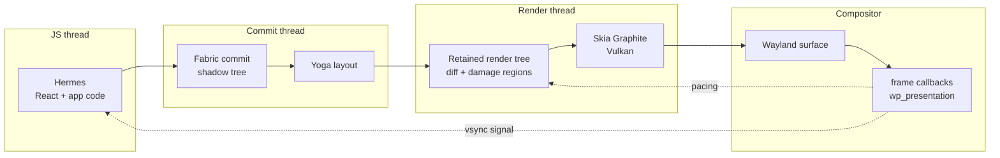

<div align="center">

# react-native-linux 🐧

### React Native for desktop Linux, GPU-first

Fabric rendered through Skia and Vulkan straight into a Wayland surface, Hermes for JavaScript,
New Architecture only. No GTK, no Qt, no webview — the renderer owns its own frame loop,
so an honest 120 fps on modern compositors is an engineering task instead of a negotiation
with somebody else's toolkit.

[](LICENSE)
[](https://github.com/react-native-linux/react-native-linux/issues/1)
[](docs/adr/0001-gpu-first-out-of-tree-react-native-platform-for-linux.md)
[](#architecture)
[](AGENTS.md)

</div>

> [!IMPORTANT]
> **There is no working code yet — this is the founding phase.**
> The architecture is decided and recorded in [ADR-0001](docs/adr/0001-gpu-first-out-of-tree-react-native-platform-for-linux.md),
> the prior-art research is being published under [`docs/research/`](docs/research), and implementation
> lands milestone by milestone starting at M0. Nothing is published to npm, nothing installs, nothing renders today.
> Track the whole thing in the founding epic: [#1 — react-native-linux v0.1](https://github.com/react-native-linux/react-native-linux/issues/1).

---

## Why another attempt

Linux is the only major desktop without a maintained React Native platform. The pieces all exist and all
work — Amazon ships React Native core on a Linux-based OS at retail scale, `react-native-skia` drew React
Native through Skia on Linux, `react-native-harmony` proved out-of-tree New Architecture platforms are
buildable by outsiders. Nobody has assembled them for desktop Linux behind a renderer that controls its own
8.33 ms frame budget.

That control is the entire thesis, and it is what separates this from the neighbouring approaches:

| | **GPU-canvas Fabric**<br/>(this project) | **GTK4-widgets Fabric**<br/>[lucid-softworks](https://github.com/lucid-softworks/react-native-linux) | **Custom reconciler**<br/>[react-native-gtkx](https://github.com/search?q=react-native-gtkx) | **Webview**<br/>react-native-web |
|---|---|---|---|---|
| **Renderer ownership** | Ours, top to bottom | GTK owns the widget tree | GTK owns the widget tree | The browser engine owns everything |
| **Frame pacing control** | Direct: `wl_surface` callbacks + `wp_presentation` | Mediated by GTK's frame clock | Mediated by GTK's frame clock | None — whatever the engine does |
| **120 fps guarantee** | Engineerable and measurable in CI | Capped by toolkit invalidation granularity | Capped by toolkit invalidation granularity | Not a design goal |
| **Native text / IME / a11y for free** | ❌ We must build all of it | ✅ Inherited from GTK | ✅ Inherited from GTK | ✅ Inherited from the engine |
| **RN ecosystem compatibility** | Fabric + TurboModules + codegen | Fabric + TurboModules + codegen | ❌ Not React Native — a separate reconciler | Web-shim subset only |

The honest trade is right there in row four: choosing the GPU canvas means text shaping, input methods and
accessibility become *our* problems rather than free gifts. ADR-0001 accepts that risk explicitly, and M5
exists because of it.

**On lucid-softworks:** their GTK4 platform is real, alpha-quality, and further along than any predecessor.
It is complementary rather than competing — widgets-integration and GPU-canvas are genuinely different
products for genuinely different apps, and learnings flow in both directions.

## Architecture

Fabric commits diff into a persistent render tree; the render thread draws only damaged regions through Skia
Graphite on Vulkan, paced by the compositor rather than by a timer. Yoga lays out off the JS thread, and
animations are native-driven from day one — a JavaScript stall must never drop a frame.



Text goes through SkParagraph (HarfBuzz shaping, FreeType rasterization) with a paragraph cache and a GPU
glyph atlas. Wayland is the only first-class windowing target; X11 arrives only if it falls out of the
abstraction for free. Full reasoning, alternatives and accepted risks live in
[ADR-0001](docs/adr/0001-gpu-first-out-of-tree-react-native-platform-for-linux.md).

### Planned developer experience

Not implemented — this is the target shape of the API, recorded so the milestones have something to aim at.

```js
// react-native.config.js — PLANNED, does not work yet
module.exports = {
  platforms: {
    linux: { npmPackageName: '@react-native-linux/core' },
  },
};
```

```bash
# PLANNED, does not work yet
npx react-native run-linux
```

Packages will publish under the `@react-native-linux/*` npm scope. The unscoped `react-native-linux` npm
name belongs to an unrelated squatted placeholder and will never be used by this project.

## Roadmap

Each milestone is demonstrable on its own — a thing you can run and watch, not a refactor.

| Milestone | Goal |
|---|---|
| [**M0**](https://github.com/react-native-linux/react-native-linux/milestone/1) | Wayland window + Vulkan Skia surface + Hermes running a bundle; a `View` renders |
| [**M1**](https://github.com/react-native-linux/react-native-linux/milestone/2) | The six core components, Yoga layout, pointer + keyboard events |
| [**M2**](https://github.com/react-native-linux/react-native-linux/milestone/3) | Native-driven animations, damage tracking, `wp_presentation`-measured 120 fps on Hyprland |
| [**M3**](https://github.com/react-native-linux/react-native-linux/milestone/4) | TurboModule codegen + autolinking; CLI/Metro registration (`--platform linux`) |
| [**M4**](https://github.com/react-native-linux/react-native-linux/milestone/5) | [Suuudokuuu](https://www.suuudokuuu.com) running as the flagship app; AUR / omarchy-pkgs packaging |
| [**M5**](https://github.com/react-native-linux/react-native-linux/milestone/6) | IME (`text-input` protocol) and AT-SPI accessibility groundwork |

"Working" is defined narrowly and deliberately: `View`, `Text`, `Image`, `ScrollView`, `TextInput` and
`Pressable`, proven by running a real application.

## Quality bar

Four test layers gate every renderer feature from day one: unit tests (GoogleTest for C++, Vitest for
TypeScript) at **100% line and branch coverage**, golden-image tests rendered headlessly on lavapipe against
checked-in references, end-to-end runs driving a real bundle under a headless compositor with virtual Wayland
input, and performance gates that fail CI when the frame budget regresses. ASan/UBSan and TSan run the full
C++ suite on every pull request, and a feature that cannot be observed through the test harness is not
finished — see [AGENTS.md](AGENTS.md#testing-gospel-non-negotiable-day-one).

## Standing on shoulders

None of this is a from-scratch idea. It is an assembly of other people's proven work:

- **[Amazon Vega](https://developer.amazon.com/apps-and-games/vega)** — ships ReactCommon, Yoga, Hermes and Fabric as the app platform of a Linux-based OS on production retail devices. The rendering layer is undisclosed, but it settles the question of whether RN core belongs on Linux.
- **[react-native-skia](https://github.com/react-native-skia/react-native-skia)** — started by **Kudo Chien** and funded by **NAGRA** (*not* a Microsoft project, despite frequent misattribution). Dormant since 2023, but it rendered React Native through Skia on X11, Wayland and DirectFB, which is the closest existing proof of this exact pipeline.
- **[react-native-windows](https://github.com/microsoft/react-native-windows)** and **[react-native-macos](https://github.com/microsoft/react-native-macos)** — the structural models for out-of-tree platform layout, C++ Fabric composition rendering, platform overrides, codegen wiring and CI shape.
- **[react-native-harmony](https://github.com/react-native-oh-library/react-native-harmony)** — the playbook for a complete out-of-tree New Architecture platform maintained outside Meta.
- **Meta's ReactCxxPlatform** — the portable C++ `ReactHost` in React Native core. It is the single change that makes a new platform tractable for a small team instead of a vendor-sized one.
- **[AccessKit](https://github.com/AccessKit/accesskit)** — the realistic path to AT-SPI accessibility for a GPU canvas that has no native widget tree to expose.
- **[lucid-softworks/react-native-linux](https://github.com/lucid-softworks/react-native-linux)** — fellow travellers on the GTK4 route, and the current state of the art for React Native on Linux.

## Research

- [**ADR-0001** — GPU-first out-of-tree React Native platform for Linux](docs/adr/0001-gpu-first-out-of-tree-react-native-platform-for-linux.md) — the founding decision: renderer choice, alternatives rejected, accepted risks, milestones.
- Prior-art and effort-calibration surveys are being published into [`docs/research/`](docs/research) as they are completed; findings that contradict ADR-0001 amend it via a new ADR.

## Contributing

Contributions are welcome, and the founding phase is the best time to argue about architecture.

1. Read [AGENTS.md](AGENTS.md) — engineering rules, threading contracts, and the non-negotiable testing gospel.
2. Read [ADR-0001](docs/adr/0001-gpu-first-out-of-tree-react-native-platform-for-linux.md) before proposing architectural changes; amendments require a new ADR.
3. Pick up work from the [milestone boards](https://github.com/react-native-linux/react-native-linux/milestones) or the [founding epic](https://github.com/react-native-linux/react-native-linux/issues/1). Every change starts with an issue that states its acceptance criteria and required test layers.

## License

[MIT](LICENSE) © react-native-linux contributors
</content>
</invoke>
